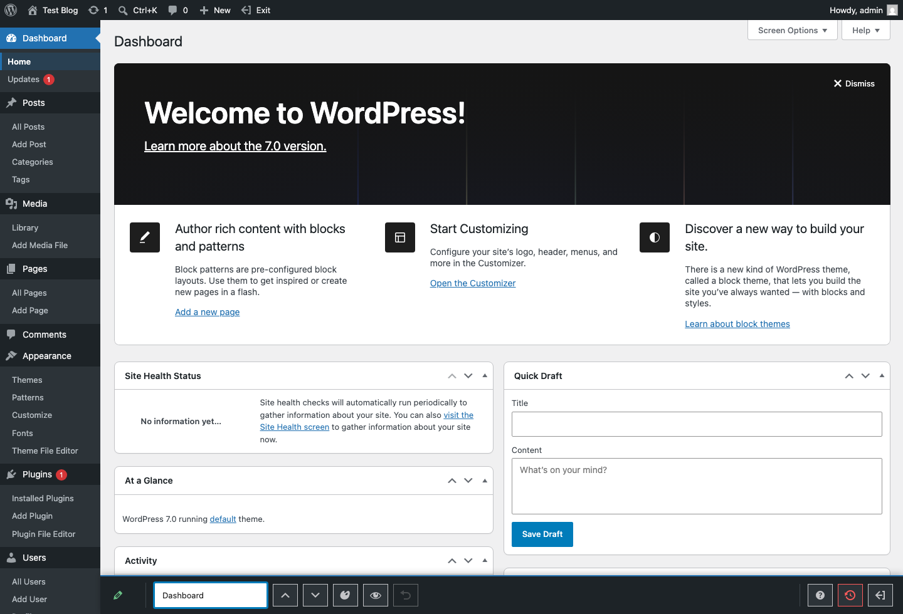
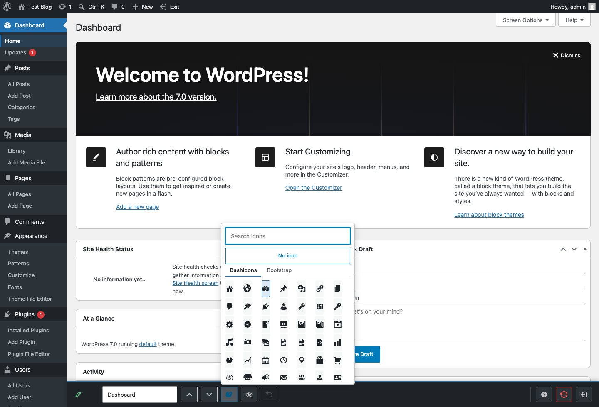
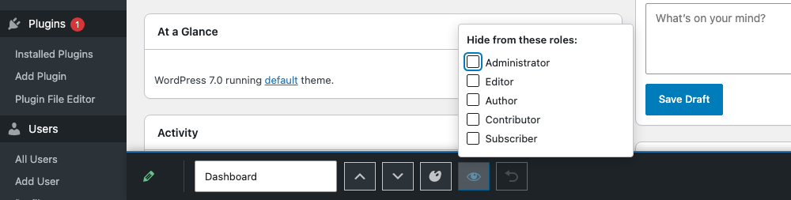
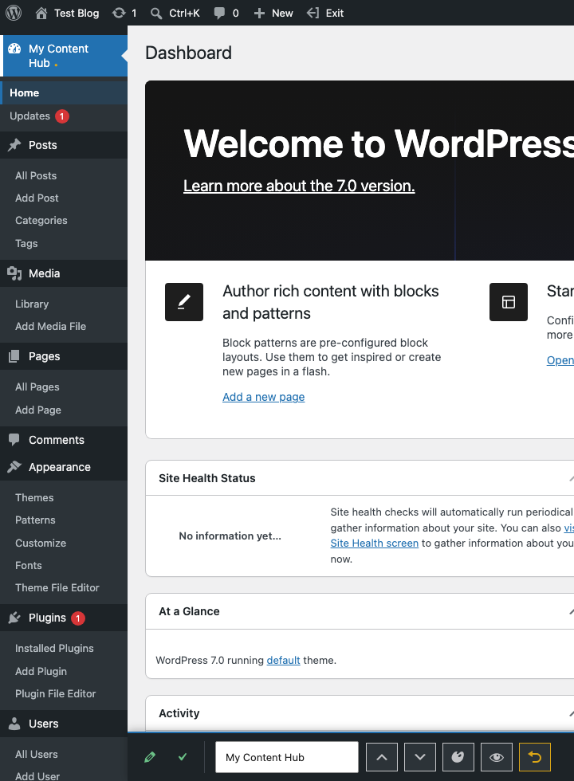

# Admin Menu Maestro

[](https://github.com/dknauss/admin-menu-maestro/actions/workflows/ci.yml)
[](https://www.gnu.org/licenses/gpl-2.0.html)
[](https://wordpress.org/)
[](https://wordpress.org/)
[](https://www.php.net/)
[](https://playground.wordpress.net/?blueprint-url=https://raw.githubusercontent.com/dknauss/admin-menu-maestro/main/playground/blueprint-hosted.json)


In-place editing of the WordPress admin menu — rename items, reorder them, swap top-level icons, and hide items per role. Global configuration, no separate settings screen: the editor is toggled from the admin bar and operates on the menu itself.

**▶ [Try it live in WordPress Playground](https://playground.wordpress.net/?blueprint-url=https://raw.githubusercontent.com/dknauss/admin-menu-maestro/main/playground/blueprint-hosted.json)** — boots a throwaway site with the plugin active, User Switching, and test users (editor / author / contributor / subscriber, password `password`) so you can try per-role visibility by switching users.

## Screenshots

Click any screenshot to open the full-size image.

| Edit mode | Icon picker |
| --- | --- |
| [](.wordpress-org/screenshot-1.png) | [](.wordpress-org/screenshot-2.png) |
| Posts selected, with the shared controls panel open. | Searchable icon picker with Dashicons and Bootstrap Icons tabs. |

| Role visibility | Autosave |
| --- | --- |
| [](.wordpress-org/screenshot-3.png) | [](.wordpress-org/screenshot-4.png) |
| Per-role visibility picker for hiding a menu item from selected roles. | Renamed menu item saved through debounced autosave. |

## Important: visibility is cosmetic, not access control

Hiding a menu item only declutters the menu — the underlying page still loads for anyone who knows its URL, because a page's own registered capability is the real lock. For actual access control, pair this with a capability manager (User Role Editor, or PublishPress Capabilities). The `admin_menu_maestro_capability` filter lets such a plugin hand editing rights to a custom capability instead of the default `manage_options`.

## Quick start

1. Activate the plugin, then choose **Edit Menu** in the admin bar.
2. Click a menu item to select it. The shared controls panel opens beside the
   menu.
3. Rename an item by editing its label. Press `Enter` to commit or `Escape` to
   restore the previous label.
4. Reorder items by dragging menu rows. Top-level items reorder among top-level
   items; submenu items reorder inside their current parent.
5. Change a top-level icon from the icon picker. Use Dashicons, bundled
   Bootstrap Icons, "No icon", or a valid WordPress icon value.
6. Hide an item from selected roles with the visibility control. This only
   changes what those roles see in the menu; it does not block the page URL.
7. Use **Reset this item** to discard one item's customizations, or **Reset
   all** to delete the saved configuration and return to WordPress defaults.
8. Choose **Exit Menu Editing** when finished. Pending autosaves are flushed
   before the page reloads.

For the longer walkthrough, see [`docs/user-guide.md`](docs/user-guide.md).

## Status

v1 complete, preparing for WordPress.org submission (release-readiness tracked in [`.planning/ROADMAP.md`](.planning/ROADMAP.md)). The server core (replay engine, REST API, sanitization) and the editor are done, and all three test layers are green (unit 44, integration 27, E2E 9; phpcs clean; Plugin Check 0/0 on the build zip). The editor uses the click-to-select model with debounced autosave specified in [`FIXES.md`](FIXES.md):

- **Debounced autosave (~500 ms)** on reorder, rename, icon pick, visibility toggle, and per-item reset — no manual Save button; a "Saving… / Saved ✓" status indicator instead. Saves are serialized (single-flight) so a slow request can't overwrite newer edits. Reload only on Exit (which flushes any pending save) and on Reset all.
- **Click-to-select with one shared controls panel.** No edit chrome until an item is selected: each row shows only a hover/focus-revealed drag handle. Selecting an item opens the shared panel (rename, icon picker for top-level items, per-role visibility, reset-this-item).
- **Stable expanded menu while editing.** Folded/auto-fold mode is neutralized on entry and re-stripped if `common.js` reapplies it, so editing always happens against the expanded menu.
- **Icons: all four native WordPress forms** (dashicon, `none`, base64 image data-URI, image URL), validated server-side. The picker bundles two sets — dashicons and ~87 curated [Bootstrap Icons](https://icons.getbootstrap.com/) — with a search filter and a "No icon" option, and is keyboard-accessible (dialog/tablist roles, arrow-key navigation, focus trap) and mobile-sized. Icon changes persist via autosave (covered by E2E: pick → POST carries the icon → survives reload).

See `FIXES.md` for the resolved punchlist and `SPEC.md` for the durable design.

## Repository layout

- **Runtime plugin** — `admin-menu-maestro.php`, `includes/`, `assets/`, `readme.txt`. This is all that ships to a site.
- **WordPress.org listing assets** — `.wordpress-org/` contains the directory icon (`icon.svg`, `icon-128x128.png`, `icon-256x256.png`), banners (`banner-772x250.png`, `banner-1544x500.png`), and screenshots (`screenshot-1.png` through `screenshot-4.png`).
- **Dev & tooling** — `tests/`, `composer.json`, `package.json`, `.wp-env.json`, `playwright.config.ts`, `phpunit-*.xml.dist`, `bin/build.sh`.
- **Docs** — `docs/user-guide.md` (user walkthrough), `SPEC.md` (durable specification), `FIXES.md` (active punchlist), `TESTING.md` (how to run each test layer).

## Install (to a site)

Build a runtime-only zip and upload it under Plugins → Add New → Upload:

```bash
bin/build.sh        # writes build/admin-menu-maestro.zip (runtime files only)
```

Activate it; **Edit Menu** appears in the admin bar. Never ship the dev tooling inside the installed plugin.

## Develop & test

```bash
composer install && composer test:unit          # pure unit tests, no WordPress
npm install && npm run env:start                 # boot WordPress + MySQL (Docker)
npm run test:php                                 # PHP integration tests
npm run test:e2e                                 # Playwright end-to-end
```

See `TESTING.md` for details and the standalone (non-Docker) paths.

## Playground demo (role testing)

A WordPress Playground blueprint (`playground/blueprint.json`) spins up a throwaway
site for trying the editor — including **per-role visibility** — without a local
WordPress. It installs [User Switching](https://wordpress.org/plugins/user-switching/),
creates four test users (`editor`, `author`, `contributor`, `subscriber`, all
password `password`), activates Admin Menu Maestro, and drops you into edit mode
as `admin`.

```bash
npm run playground
```

This builds the runtime-only plugin, mounts it into Playground, runs the
blueprint, and serves at `http://127.0.0.1:9400`. Hide a menu item from a role
in the editor, then use **Switch To** (admin bar) to view the menu as that user.

> **Hosted Playground:** the [Live demo](https://playground.wordpress.net/?blueprint-url=https://raw.githubusercontent.com/dknauss/admin-menu-maestro/main/playground/blueprint-hosted.json)
> runs the same setup in the browser with no install. It uses
> `playground/blueprint-hosted.json`, which installs the plugin straight from
> this public repo via a `git:directory` resource (the local `blueprint.json`
> mounts it instead).

## License

GPL-2.0-or-later. See [`LICENSE`](LICENSE).
